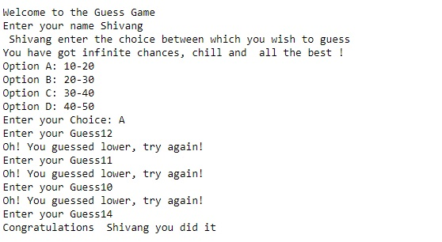
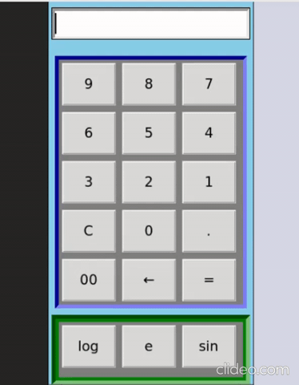

# HacktoberFest2020
Repository to let enthusiasts create issues and pull requests for the Open Source event.

### NOTE
## No Pull request would be accepted without a brief description about the project or code being pulled. 

## Table of Contents

-   [About the Repository](#abouttherepository)
-   [Libraries/Tools used](#librariestoolsused)
-   [Concepts used](#conceptsused)
-   [How The Guess Game Works](#howtheguessgameworks)
-   [Calculator](#calculator)
-   [Development](#development)

### About the Repository:
(There are 2 scripts in this repository)
1) Basic Number Guessing Game, created in Python3
2) Receipt Generator for Shopping bills
3) Calculator using tkinter in python
 
### Libraries/Tools used:
1) Random package
2) Math package
3) tkinter package

### Concepts used:
1) While loop
2) If-Else
3) Graphical User Interface

### How The Guess Game Works:
1) Step One: Add your name.
2) Step Two: Select an option to guess a number.
3) Step Three: The game starts to guessing the numbers.

**Screenshot**

### Calculator:

This Program run on both Windows and Linux operating system by using pycharm, anaconda 3 or all. other python editor with the python version 3.x.
This software is developed by python 3.x.
Used tkinter module for the Graphical User Interface.
It is more secure which means you may not enter other anything except the numerical values.
It is more relevant and easy to use for an user.

1) It performs Addition, Subtraction, Multiplication and Division
2) If you want to clear the recent entered value, you should click the button **C**
3) If you want to erase the history, you should click the button **AC**

**Screenshots**

### Development

Want to contribute? Great! Please check the .  

This repository is the starter code for you. Therefore, I would like to accept your pull requests 😎
